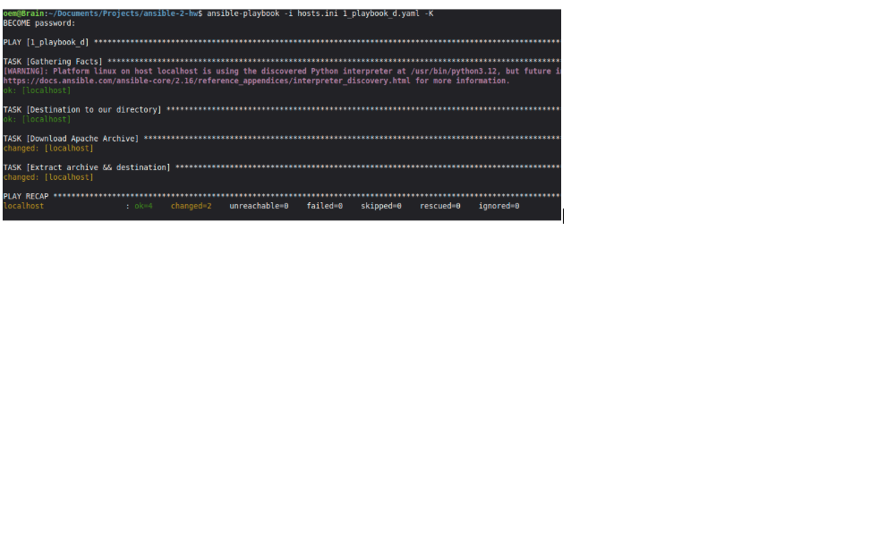
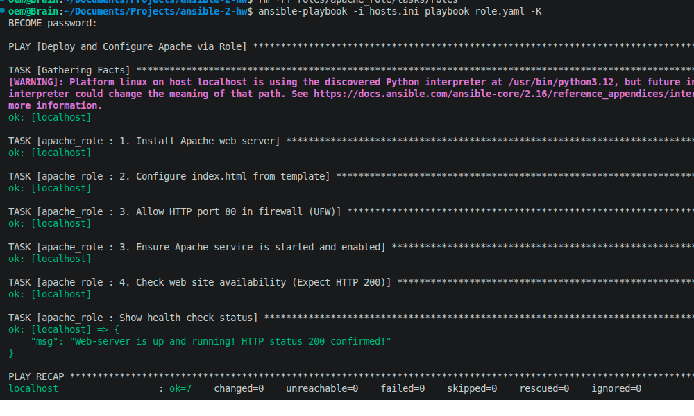
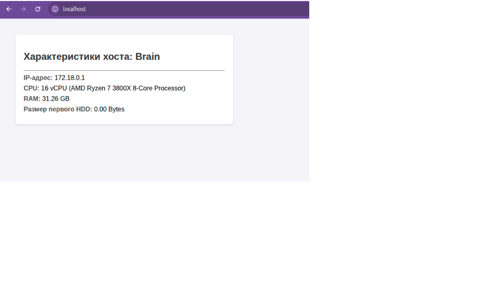

# Домашнее задание к занятию «Ansible. Часть 2» — Константин [Ваша Фамилия]

---

## Задание 1

### 1. Скачивание и распаковка архива (Apache Kafka)
- **Файл плейбука:** `1_playbook_d.yaml`
- **Вывод выполнения:**

---

### 2. Установка и запуск службы tuned
- **Файл плейбука:** `2_playbook_tuned.yaml`
- **Вывод выполнения:**

---

### 3. Настройка приветствия MOTD через переменную
- **Файл плейбука:** `3_playbook_motd.yaml`
- **Вывод выполнения:**

---

## Задание 2
Модификация плейбука для вывода IP-адреса, hostname и пожелания с использованием Ansible Facts.

- **Файл плейбука:** `task2_motd.yaml`
- **Вывод выполнения и проверка команды cat /etc/motd:**

---

## Задание 3
Создание роли `apache_role` для установки Apache, генерации страницы через Jinja2-шаблон и проверки статуса HTTP 200.

- **Файл вызова роли:** `playbook_role.yaml`
- **Шаблон Jinja2:** `roles/apache_role/templates/index.html.j2`
- **Файл задач роли:** `roles/apache_role/tasks/main.yml`

### Результат выполнения роли:

### Скриншот страницы в браузере (http://localhost):

